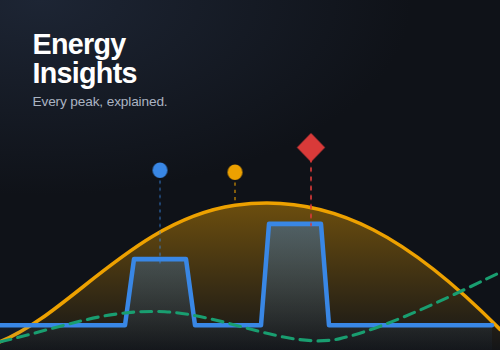

# Homey Energy Insights

A Homey app (SDK v3, app id `com.homey.energyinsights`) that turns every `measure_power` reading in
your home into one annotated timeline, and explains why each peak happened.



## What it does

- **One timeline, three series.** Power usage, solar production and net grid power on a shared
  time axis in Watts, from a live 5 second feed back to 48 hours of history.
- **Event markers on the chart.** Every marker sits at the moment it happened: a device switching
  on or off, solar production starting, the day's peak solar yield, the start of net feed-in, and
  every detected power peak.
- **Peaks that explain themselves.** A peak marker carries a sentence like *"Peak caused by Air
  Conditioning starting while solar yield dropped by 2.1 kW"*, built by ranking what every metered
  device did over the preceding minute against what solar did in the same window.
- **A dashboard and a widget.** A full settings page with scrubbing, zooming and a tap-for-why
  tooltip, plus a compact Homey dashboard widget.
- **Flow cards** for peaks, device-attributed spikes, solar milestones, feed-in, and for writing
  your own markers onto the timeline.
- **A mirror device** so net power, usage, solar, self-sufficiency, a peak alarm and the last peak
  reason show up in Insights and in other Flows.

## Requirements

Homey Pro on firmware **12.2.0 or newer** (the dashboard widget needs 12.2). The app asks for the
`homey:manager:api` permission, which is what lets it watch `measure_power` and `onoff` across all
of your devices.

## Install for development

```bash
npm install
npm run validate          # homey app validate --level publish
npm test                  # 35 tests, no Homey required
npm start                 # homey app run
```

Open **Settings → Apps → Homey Energy Insights → Configure** for the dashboard, and add the
*Energy Timeline* widget to a Homey dashboard for the compact view.

## First run

The app classifies your devices automatically: a `solarpanel` device becomes solar production, a
device that reports cumulative energy for the whole home becomes the grid meter, and everything
else counts as a consumer. Check the **Devices** tab and correct anything it got wrong - the role
you pick there is remembered and decides how each device counts.

With a grid meter present the meter is the source of truth for net power and household usage is
derived from it, so the part of your usage that no smart plug measures still shows up (and can
still be named as the cause of a peak).

## Documentation

- [`RUNBOOK.md`](RUNBOOK.md) - architecture, every design decision and its rationale, what is
  verified and what is not, and how to pick the work up from here.
- [`tools/preview/README.md`](tools/preview/README.md) - regenerating screenshots and artwork.

## Licence

MIT
